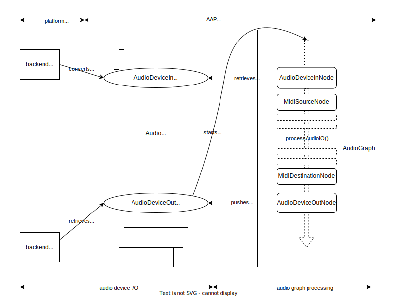

# AAP plugin manager application

`androidaudioplugin-ui-compose-app`, along with `androidaudioplugin-manager`, is designed for either a plugin or a host to manage a plugin as a client. In both cases, the app first launches `PluginList` which lists the target plugins (plugins in the app for a plugin app, plugins on the system for a host app), and let user to navigate to `PluginDetails` i.e. one particular plugin, play and/or configure it.

## androidaudioplugin-manager

`androidaudioplugin-manager` implements the plugin playback feature without the UI, mostly in native code. It has a Kotlin facade `PluginPlayer`, which delegates most of the work to C++. The feature does not really sound like that of a manager, but it is the result of (the required functionality for manager) && (required as native).

The C++ API is also supposed to be used by native apps, if applicable. We might rewrite `androidaudioplugin-midi-device-service` internals based on the new code.

It comes with `aap::SimpleLinearAudioGraph`, a sequential processor of audio nodes. It is NOT really a graph, just a `std::vector<AudioGraphNode>` indeed, but still implements some concepts for audio graph nodes. (There is also `aap::BasicAudioGraph` class, but it is not being implemented for now.)

### `AudioGraph` and `AudioGraphNode`s

`AudioGraph` is an abstract class for use in `PluginPlayer` (C++). `SimpleLinearAudioGraph` implements it (so as `BasicAudioGraph`, which is a vaporware ATM). It conceptually aggregates `AudioGraphNode`s as a directional acyclic graph (DAG). `SimpleLinearAudioGraph` does not let you edit the graph. It is a fixed list of these nodes:

- `AudioDeviceInNode`
- `AudioDataSourceNode`
- `MidiSourceNode`
- `AudioPluginNode`
- `MidiDestinationNode`
- `AudioDeviceOutNode`

The diagram below is a flow chart for the audio graph processing for current `SimpleLinearAudioGraph` design. It covers some topics explained later.

### Audio device I/O abstraction

`androidaudioplugin-manager` defines its own abstraction layer for audio device I/O. To support low latency audio, it is defined as callback API. They are abstracted away as `AudioDeviceIn` and `AudioDeviceOut`. There is `AudioDeviceManager` abstract class that open those I/O devices too. There are `Oboe` and `Virtual` implementation for them (virtual does not do anything).

Since platform audio API is different for each platform, we also abstract away the audio buffer layer, named as `AudioBuffer` in C++ code for now.

`AudioDeviceIn` and `AudioDeviceOut` provides `setAudioCallback` function that takes `AudioDeviceCallback`. The callbacks are invoked whenever the platform audio API yields a new callback, for each.

This layer primarily takes care of these tasks:

- convert platform audio data to and from our platform-agnostic AAP audio buffer (including interleaving/de-interleaving)
- unify platform audio callbacks into our callback system consistently

#### Callbacks

To consolidate platform audio I/O from our abstract audio I/O, the `AudioDeviceOut` callback in `SimpleLinearAudioGraph` (managed by `AudioDeviceOutNode`) starts `SimpleLinearAudioGraph.processAudio()`. The caller of the callback (`OboeAudioDeviceOut`) expects a completed audio processing result within the call, and then converts the result into platform-specific audio data to write to the platform buffer.

#### Input and Output Handling

For our Oboe implementation case, `OboeAudioDeviceIn` reads the input from the Oboe callback, converts it to AAP audio data, and kicks its callback if any. `SimpleLinearAudioGraph` does not register any callback, but that does not mean we skip audio inputs. The buffered audio input should be "taken" by `AudioDeviceInNode`: it copies the inputs and sets to the outputs.

Next time `AudioDeviceIn` platform audio callback happens, the audio buffer may go away, so `AudioDeviceInNode` is supposed to take the audio data from `AudioDeviceIn` in timely manner (typically within an audio callback either from the input device or the output device).

Similarly, data sent to `AudioDeviceOutNode` will be stored within the node and is supposed to be written to the platform audio buffer, in the platform-specific format (`OboeAudioDeviceOut` does the task). The node itself does not directly writes out to `AudioDeviceOut` - it is the audio callback which is supposed to do the job.

#### Ring Buffers

Since `AudioDeviceIn` and `AudioDeviceOut` involves audio buffering and there might be need for buffering in case more than one audio-in callbacks happen while waiting for one audio-out callback and data may flush out, we store AAP audio inputs (converted from the platform audio inputs) into a ring buffer, for each device.

#### Audio Recoring Permission

One thing to note is that audio inputs needs to be explicitly enabled. In `PluginPlayer` case, it is triggered by `RECORD_AUDIO` permission checker - if it is permitted then `PluginPlayer.enableAudioRecorder()` is invoked, which in turn enables the Oboe input callback.

### Configuration

`PluginPlayer` is a host application that is tailored for hosting one single AAP plugin.

While it could be configured per plugin (because there is only one plugin in the audio graph, it is quite possible), we would begin with a fixed Stereo audio bus configuration (i.e. left and right for the input and the output), with a virtual MIDI2 input port and a virtual MIDI2 output port.

However, we can specify the number of input channels at `PluginPlayer` constructors so it may still work. What is left unsupported is adjusting input audio file data to what `AudioBuffer` expects (for audio device inputs it is handled at Oboe or AAudio).

#### Configuration Changes

The audio config changes (not to confuse with Android device config changes such as device orientation) will trigger rebuilding of the entire `AudioGraph`, as it involves reallocation of memory resources and potential total breakage of position information. Files need to be reloaded and re-converted to the new channel layout, the new sample rate, and the new frame size.

Rebuilding `PluginPlayer` involves state saving and restoring of the plugin.

### External Dependencies

We use Tracktion/choc for a few utilities:

- audio buffer interleaving and de-interleaving
- audio file decoding and resampling

It is somewhat risky to depend on it because choc API is not stable (it's like using Skia), but we can keep using a fixed version if we find upgrades problematic.
